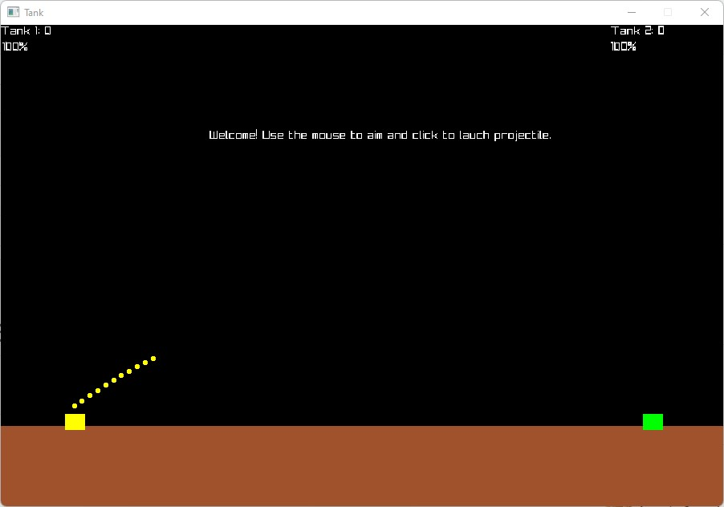

# Overview
---
Tank is a game in which two players seeks to destroy each others tank by launching projectiles in a turn based environment. The game has multiple rounds, each round ends when a player has ran out of health! The game continues until ten rounds have passed and a winner is declared.

---
## Rules
---
Tank is played according to the following rules:

* Player 1, Yellow, will use the mouse to target Player 2.
* Player 2, Green, will use the mouse to target Player 1.
* If a player successfully hits the opponent until they are out of health, that player wins the round and a new round begins.
* The game continues until all ten rounds have been played.

---
## Interface

---


---
## Getting Started

---
Make sure you have Python 3.8.0 or newer and Raylib Python CFFI 3.7 installed and running on your machine. You can install Raylib Python CFFI by opening a terminal and running the following command.
```
python3 -m pip install raylib
```
After you've installed the required libraries, open a terminal and browse to the project's root folder. Start the program by running the following command.```

python3 __main__.py
```
You can also run the program from an IDE like Visual Studio Code. Start your IDE and open the 
project folder. Select the main module inside the hunter folder and click the "run" icon.

---
## Project Structure

---
root                  (project root folder)
+-- data              (data files for game)
+-- game              (specific game classes)
+-- __main__.py       (entry point for program)
+-- README.md         (general info)

---
## Required Technologies

---
* Python 3.8.0
* Raylib Python CFFI 3.7

---
## Authors

---
* Antonio Saucedo (antoniojesus@byui.edu)
* Godwin Iyip (iyi21001@byui.edu)
* Manuel Cipriano (cip21002@byui.edu)
* Shane Cook (scc0131@byui.edu)
* (Cole) Ukeje Chinemerem (uke21001@byui.edu)